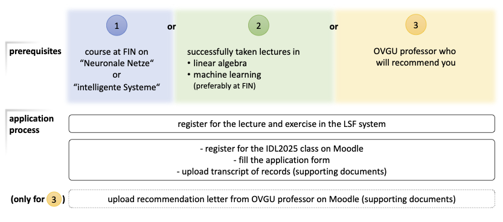

# Introduction to Deep Learning
---------------------------------

Summer Semester 2025  
[Prof. Dr. Sebastian Stober](http://www.ai.ovgu.de/Staff/Stober.html),
[Jens Johannsmeier](http://www.ai.ovgu.de/Staff/Johannsmeier.html)  
Thu 11:00-13:00; G29-307

**Start: Thursday, April 10**

---

>_"I have worked all my life in Machine Learning, and I've never seen one algorithm knock over benchmarks like Deep Learning."_  
>[Andrew Ng (Stanford / Baidu)](http://www.andrewng.org/)

Over the last decade, so-called "deep learning" techniques have become very popular in various application domains such as computer vision, automatic speech recognition, natural language processing, and bioinformatics where they produce state-of-the-art results on various challenging tasks.
Most recently, deep neural networks even succeeded in [mastering the game of go](http://www.nature.com/news/google-ai-algorithm-masters-ancient-game-of-go-1.19234).

A crucial success factor of deep neural networks is their ability to learn hierarchies of increasingly complex features from raw input data.
Such representations often outperform traditionally hand-crafted features that require expensive human effort and expertise.
But they do not come as a free lunch.
Designing and training deep neural networks such that they actually learn meaningful and useful feature representations of data is an art itself.
Mastering it requires practice and experience - and this course offers many opportunities to obtain these.

This is an intense course following a **"flipped classroom" design** that builds on everybody's active participation.
The curriculum roughly follows Part II of the [Deep Learning Book](http://www.deeplearningbook.org/) but also covers recently published advances in the field.
You will be responsible to **prepare for each class by reading selected literature** or watching online video lectures and talks.
Student are further encouraged to self-reflect on their learning progress in a brief weekly blog post.
This can, for instance, include open questions, self-discovered answers or pointers to additional helpful material.
Most of the in-class time will be used to discuss the open questions about the concepts under study.
There will also be **increasingly complex programming assignments** where you can apply and practice what you just learned and develop new ideas.
All implementations will be in Python (version 3) within the [Google Colaboratory environment](https://colab.research.google.com).

As prerequisites for the course, you need to already have basic knowledge on machine learning in general as well as linear algebra and probability theory.
Those who would like a refresher prior to taking this class can find an excellent compilation in Part I of the [Deep Learning Book](http://www.deeplearningbook.org/).
You also have to know already how to program in Python at least a basic level.
For a quick introduction, several tutorials are linked from the [official Python wiki](https://wiki.python.org/moin/BeginnersGuide/Programmers).
And of course you should bring some curiosity to embark on an open-ended and exploratory learning process.

**The number of participants for this course is limited to 60. Admission is by application as detailed below.**

### Administrative Terms & Conditions (a.k.a. the "fine print")

The following figure gives an overview about the three possible prerequisites and the corresponding application requirements.  
Please take a moment to read these information carefully!  
If you afterwards have got further questions about the course, please contact [Sebastian Stober](mailto:stober@ovgu.de).

**Note** As of summer 2025, this lecture is offered as 6CP course for master programmes and as 5CP course for bachelor programmes. The difference in credit points results from more advanced/transfer tasks to be completed in the exercises.

([Link to LSF system](https://lsf.ovgu.de/qislsf/rds?state=verpublish&status=init&vmfile=no&moduleCall=webInfo&publishConfFile=webInfo&publishSubDir=veranstaltung&veranstaltung.veranstid=222096)
| [Link to Moodle](https://elearning.ovgu.de/course/view.php?id=18673) - Course Password: IDLSS25)  
Your submitted information will be solely used for application process. It will be treated confidentially and deleted after the candidates have been selected.  

The deadline for applications is **April 4 (23:59), 2025**. Applications arriving later will only be considered if there is still course capacity.

The aim of this process is to select students that are likely to successfully complete the course and not drop out half way through.

#### Credits

The course belongs the to topic domain "practical computer science" and amounts to **5 credit points** (equivalent to **150 hours**) or **6 credit points** (equivalent to **180 hours**).
The expected weekly commitment is about 10 hours including 2x90 minutes in-class time.
Be prepared to spend that much time!
If you are into the topic and want to go deeper, rather plan for some extra time - it's worth it!

#### Exams

The lecture concludes with a two-hour written exam.
Students can decide whether they want the exam to be a written exam or a (un)graded certificate of achievement (Schein).
Admission to the exam must be obtained through active participation throughout the course (especially in the exercises, see below).

Students who need an ungraded certificate of achievement must also attend the exam and gain admission through active participation in the course.
Upon passing the exam (grade 4.0 and better) the certificate will be issued.

#### Exam Admission Criteria

In order to be admitted to the exam, you must not fail weekly assignments more than 2 times. Submissions are only successful if handed in in time and if you are able to present the solution on request during the respective exercise session.

#### Exercises

There will be two groups for the exercise.
To participate in the exercises, you must register in the 
[LSF system](https://lsf.ovgu.de/qislsf/rds?state=verpublish&status=init&vmfile=no&moduleCall=webInfo&publishConfFile=webInfo&publishSubDir=veranstaltung&veranstaltung.veranstid=222098).
Registration is possible until April 4, 2025.
When you apply for the exercise, you can specify priorities for the different dates.
Please specify both dates with different priorities as we cannot guarantee that everybody will be assigned to their first choice!

Please note: The final grouping of students into exercise groups will take place after the LSF registration deadline has passed.
The allocation is based on the priorities that you indicated when you signed up.

The change or visit of another group should remain the exception and must be communicated by email before the first of the two exercises.

#### Programming Assignments

There will be weekly programming assignments.
Solutions can be handed in until a specified deadline and will be discussed in the subsequent exercise session.
They do not have to be completely correct, but it must be clearly visible that a substantial effort has been made to solve the task.
Assignments can be done in groups of up to three students, but each student has to be able to present and explain their solution by themselves if asked to.
If a solution contains copied / adapted code, the respective sources need to be cited in the code comments. 
If you fail to explain your solution (which should not happen if it is your solution), the assignment will be considered as failed. 
More than two fails will result in exclusion from the exam.

Remember that missing a deadline without excuse also results in a fail. Please plan accordingly and work in advance if you know you will be absent during the semester! Exception can only be made in case of illness (which requires a medical certificate from a doctor).
